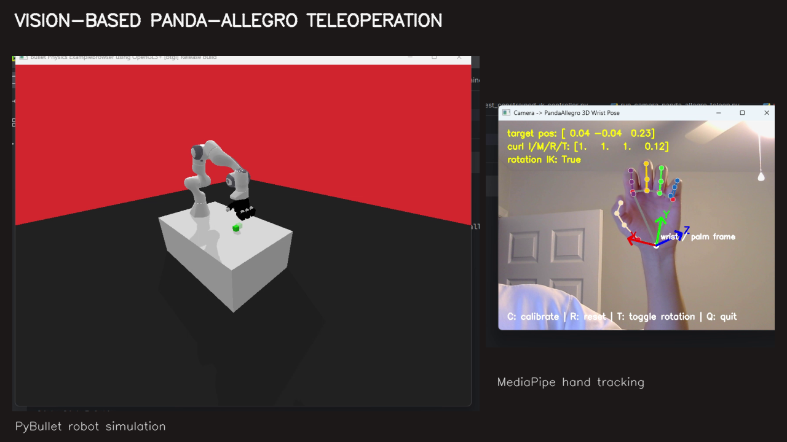
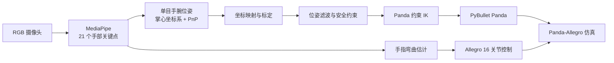

# 基于视觉的 Panda-Allegro 手臂重定向与遥操作

[English](README_EN.md) | 中文


> **开发中项目：** 本仓库用于公开记录一个仍在持续迭代的视觉遥操作系统，接口、参数和实验结果可能继续变化。

一个面向 Panda 机械臂与 Allegro Hand 的实时视觉重定向项目。系统从普通 RGB 摄像头获取手部图像，通过 MediaPipe 关键点、单目手腕位姿估计、坐标映射、运动滤波和约束逆运动学，将人的手臂与手指运动映射到 PyBullet 中的机器人。

[](media/hand-arm-retargeting-demo.mp4)

*点击图片查看经过裁剪的 16 秒演示视频。左侧为 Panda-Allegro 仿真，右侧为手部关键点、掌心坐标系与控制状态。*

## 当前能力

- 使用 MediaPipe 从 RGB 摄像头实时提取单手 21 个关键点。
- 结合掌心几何和 PnP 估计单目手腕三维位置与方向。
- 将摄像头坐标中的相对运动映射到 Panda 基座坐标。
- 使用 One Euro Filter、速度限制、加速度限制和工作空间边界抑制抖动。
- 使用连续性约束、软关节限位和误差检查求解 Panda 机械臂 IK。
- 将四根手指的弯曲程度映射到 Allegro Hand 的 16 个关节。
- 在定制 `PandaAllegroPickAndPlace-v0` PyBullet 环境中进行可视化验证。



## 快速开始

### 1. 创建环境

推荐使用 Conda：

```bash
conda env create -f environment.yml
conda activate hand-arm-retargeting
```

也可以使用现有 Python 3.10 环境：

```bash
python -m pip install -r requirements.txt
```

依赖文件会以 editable 模式安装仓库中的定制 `panda-gym`。

### 2. 连接摄像头并运行

```bash
python scripts/run_camera_panda_allegro_teleop.py
```

默认使用摄像头索引 `0`、分辨率 `640 × 480`。当前仓库中的内参是通用初始值，换用其他摄像头时应重新标定。

### 3. 键盘控制

| 按键 | 功能 |
|---|---|
| `C` | 重新开始完整标定 |
| `R` | 重置机器人参考位姿 |
| `T` | 开关手腕方向跟踪 |
| `Space` | 暂停或继续遥操作 |
| `Q` | 退出 |

## 项目结构

```text
.
├── configs/                # 摄像头内参与坐标映射配置
├── docs/images/            # README 演示封面
├── media/                  # 经过裁剪的公开演示视频
├── scripts/                # 主程序、构建工具与交互式测试
├── src/teleop/             # 位姿估计、映射、滤波和约束 IK
├── vendor/panda-gym/       # 定制 Panda-Allegro 仿真环境与必要资产
├── environment.yml
├── requirements.txt
└── THIRD_PARTY_NOTICES.md
```

## 验证环境

- Python 3.10.20
- NumPy 1.26.4
- SciPy 1.15.2
- OpenCV 4.10.0.84
- MediaPipe 0.10.21
- Gymnasium 1.3.0
- PyBullet 3.2.5
- 定制 panda-gym 3.0.8

## 当前限制

- 当前重点是 PyBullet 仿真，还没有接入实体 Panda 与 Allegro Hand。
- 单目深度与手腕方向会受光照、遮挡和摄像头标定影响。
- 部分 `scripts/test_*.py` 是交互式实验脚本，不是自动化单元测试。
- 控制和滤波参数目前仍在代码中，后续将迁移到配置文件和命令行参数。
- 本仓库没有包含原始录屏、性能追踪 JSON、IDE 配置或 Python 缓存。

## 路线图

- [ ] 完善摄像头标定与可复现的设置流程
- [ ] 将运行参数迁移到 YAML/CLI
- [ ] 为位姿映射、滤波和 IK 增加自动化测试
- [ ] 增加丢帧、遮挡和异常姿态处理
- [ ] 量化端到端延迟、抖动和跟踪误差
- [ ] 设计实体机器人通信与安全停止接口

## 第三方组件与许可证

本仓库包含定制的 `panda-gym` 代码和必要机器人模型。相关许可证与来源见 [THIRD_PARTY_NOTICES.md](THIRD_PARTY_NOTICES.md)。项目自身的根许可证尚未确定。

## 作者

Eason Yin · [@y2y6q](https://github.com/y2y6q)
