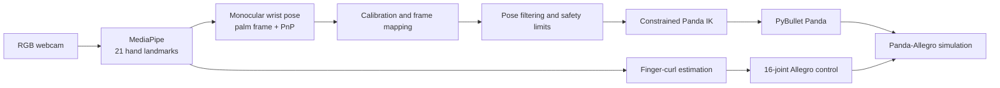

# Vision-Based Hand-Arm Retargeting for Panda-Allegro Teleoperation

English | [中文](README.md)


> **Work in progress:** This repository documents an actively developed vision-based teleoperation system. Interfaces, parameters, and experimental results may continue to change.

A real-time vision-retargeting project for a Panda arm and Allegro Hand. The system observes a human hand through a standard RGB webcam and combines MediaPipe landmarks, monocular wrist-pose estimation, coordinate mapping, motion filtering, and constrained inverse kinematics to drive a simulated robot in PyBullet.

[](media/hand-arm-retargeting-demo.mp4)

*Click the image to open the cropped 16-second demo. The Panda-Allegro simulation is shown on the left; hand landmarks, the palm frame, and control state are shown on the right.*

## Current Capabilities

- Track 21 landmarks from one hand in real time with MediaPipe.
- Estimate monocular 3D wrist position and orientation from palm geometry and PnP.
- Map relative camera-space motion into the Panda base frame.
- Suppress jitter with One Euro filtering, velocity and acceleration limits, and workspace constraints.
- Solve Panda arm IK with continuity checks, soft joint limits, and pose-error rejection.
- Retarget four finger curls to the 16 joints of an Allegro Hand.
- Validate the full loop in a custom `PandaAllegroPickAndPlace-v0` PyBullet environment.



## Quick Start

### 1. Create the environment

Conda is recommended:

```bash
conda env create -f environment.yml
conda activate hand-arm-retargeting
```

Alternatively, use an existing Python 3.10 environment:

```bash
python -m pip install -r requirements.txt
```

The dependency files install the customized vendored `panda-gym` in editable mode.

### 2. Connect a webcam and run

```bash
python scripts/run_camera_panda_allegro_teleop.py
```

The default camera index is `0` at `640 × 480`. The included intrinsics are generic initialization values; recalibration is recommended for another camera.

### 3. Keyboard controls

| Key | Action |
|---|---|
| `C` | Restart full calibration |
| `R` | Reset the robot reference pose |
| `T` | Toggle wrist-orientation tracking |
| `Space` | Pause or resume teleoperation |
| `Q` | Quit |

## Repository Layout

```text
.
├── configs/                # Webcam intrinsics and frame-mapping configuration
├── docs/images/            # README demo cover
├── media/                  # Cropped public demo video
├── scripts/                # Main program, build tools, and interactive tests
├── src/teleop/             # Pose estimation, mapping, filtering, and constrained IK
├── vendor/panda-gym/       # Customized Panda-Allegro environment and required assets
├── environment.yml
├── requirements.txt
└── THIRD_PARTY_NOTICES.md
```

## Verified Environment

- Python 3.10.20
- NumPy 1.26.4
- SciPy 1.15.2
- OpenCV 4.10.0.84
- MediaPipe 0.10.21
- Gymnasium 1.3.0
- PyBullet 3.2.5
- Customized panda-gym 3.0.8

## Current Limitations

- The current focus is PyBullet simulation; no physical Panda or Allegro Hand is connected yet.
- Monocular depth and wrist orientation remain sensitive to lighting, occlusion, and camera calibration.
- Several `scripts/test_*.py` files are interactive experiments rather than automated unit tests.
- Controller and filter parameters are still defined in code and will move to configuration files and CLI options.
- Raw recordings, performance traces, IDE metadata, and Python caches are intentionally excluded.

## Roadmap

- [ ] Improve camera calibration and provide a reproducible setup procedure
- [ ] Move runtime parameters to YAML/CLI configuration
- [ ] Add automated tests for pose mapping, filtering, and IK
- [ ] Improve dropped-frame, occlusion, and outlier handling
- [ ] Benchmark end-to-end latency, jitter, and tracking error
- [ ] Design a physical-robot communication and safety-stop interface

## Third-Party Components and Licensing

This repository includes customized `panda-gym` code and the robot assets required by the environment. See [THIRD_PARTY_NOTICES.md](THIRD_PARTY_NOTICES.md) for origins and license locations. A root license for the project-specific code has not yet been selected.

## Author

Eason Yin · [@y2y6q](https://github.com/y2y6q)
